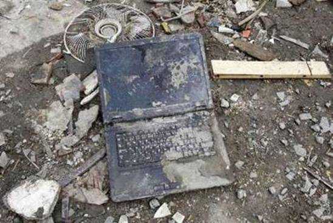
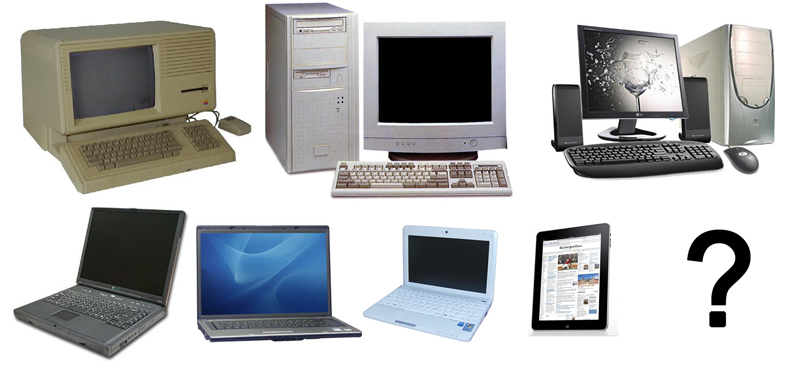

## Instructions and Requirements

Imagine that that you are an archaeologist 1000 years in the future. You are part of a team excavating a small portion of a once prosperous city (or, perhaps, what is thought to have been a rural "hinterland"). The general area of the excavation is thought to be a habitation site.

While excavating, you and your team recover many different types of artifacts. For example, what artifacts may exist in the image below?

 

1. Choose an "artifact" that has been recovered from the site. To to this:
    + Check the glossary to review the terminology that archaeologists use:  What an <a href="https://diigo.com/08aol0" target="_blank"><b>artifact</b></a>?

> Artifacts are distinguished from the main body of the archaeological record such as stratigraphic features, which are non-portable remains of human activity, such as hearths, roads, deposits, trenches or similar remains, and from biofacts or ecofacts, which are objects of archaeological interest made by other organisms, such as seeds or animal bone. (Wikipedia)

How to choose an artifact? Look around your house; what types of "artifacts" do you see? For example, think of common things around a house or yard (e.g., cell phone, toaster oven, toilet, grill). As you are forming your artifact's display caption, think about what you have learned regarding how archaeologists classify artifacts.

2. In your description, think about the following:

    + How may the artifact be classified (material, style, function, form)?
    + What was the purpose of the artifact, did it hold any special ritual significance, or was it an instrument of everyday use?
    + What about the artifact, and its context, may have given data for your interpretation?
    
It may help to watch these two short videos illustrating artifact classification:

<iframe width="560" height="315" src="https://www.youtube.com/embed/VDNjORpTmj8?rel=0" frameborder="0" allowfullscreen></iframe>

<iframe width="560" height="315" src="https://www.youtube.com/embed/RcxQTr4BDs4?rel=0" frameborder="0" allowfullscreen></iframe>
 
    
Consider our "artifact" (i.e., the laptop computer) from the image above. Have similar artifacts been recovered at other localities? How do styles of this type of artifact change over time? Recall what you have learned about <a href="http://proteus.brown.edu/fieldarchaeology2014/20064" target="_blank"><b>typologies</b></a>. What do these changes reflect, in terms of human behavior? In the image below, we can see that this artifact type has changed significantly over the last 25--30 years.

 

## Submission Directions

To complete the assignment, follow these steps:

- Choose an item and describe it according to the requirements outlined above.
- At the top of the page, make sure you include the real name and a photo of the object you have chosen as your "artifact." Feel free to give this artifact a fictional name in the actual classification/description.
- Using a word-processing application, write your description.
- Go to the next page to upload and submit the file using Blackboard's assignment tool.

## Evaluation Criteria

The assignment will be evaluated on the following:

- Following instructions
- Required content: See above; the description should be 2-3 paragraphs (around 200--250 words).
    + The description should be written as if it were for a museum display caption, so think about your intended audience. 
- Formatting requirements:
    + Font: Calibri, Arial, or Times New Roman font (size 10-12 pt)
    + Margins: 1 inch (all sides)
    + Spacing: Heading (single), body (double)
    + Spelling/grammar: Formal

__Please adhere to the directions outlined above. If you stray, it may result in unnecessary point deduction.__

----

Continue to the next page to access the submission tool for this assignment, or continue through the module to access other content.