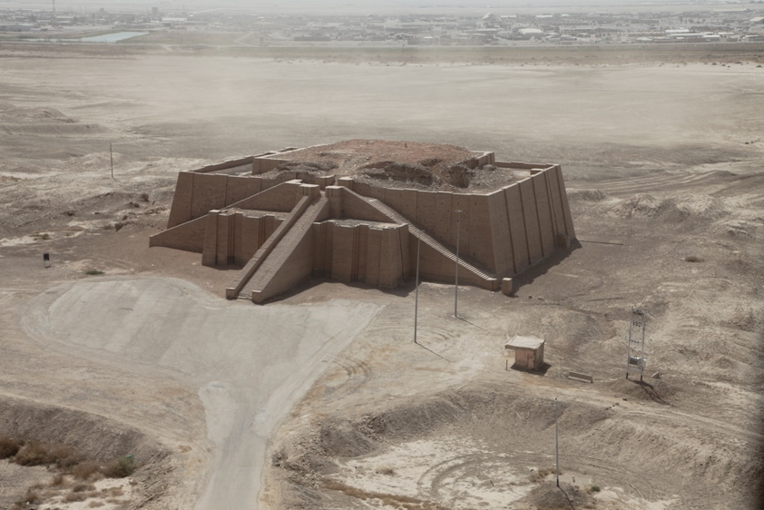
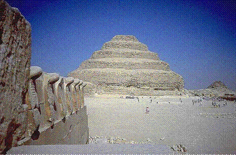

---
title: "Lesson 8 Introduction"
author: "ANTH 102-W1---Fall 2014"
output:
  html_document:
    fig_caption: yes
    theme: united
---

So, we've come quite a way in our survey of world prehistory. As previously discussed, variation and elaboration in the expression of material culture (that we observed through the lens of archaeology) among human groups has increased at an ever quicker pace, especially since the beginning of the Neolithic. We have seen that in various regions around the world, the process of plant (and animal) domestication was a complex process that followed different trajectories as the result of interactions between humans and their environment at the local level. Certainly, populations incorporated agriculture into their existing subsistence economy to varying degrees---some completely, others not at all (there are a handful of extant [hunter-gatherer groups](http://dienekes.blogspot.com/2011/10/affluent-hunter-gatherers-revisited.html)!). 
 
The phenomenon of humans living in larger, more-permanent, and denser populations provided the conditions for associated increases in social complexity---the emergence of craft specialists, bureaucrats, and elites (i.e., non-food-producing members of the population). Someone, or at least a small group of individuals, now had authority over others. This power had to be legitimated, either through coercion, charisma, or a combination of the two. Why else would larger number of people to build something like the ziggurat at Ur, while a small number of elites just watched?


 
In this lesson, we will take a look at how anthropologists and archaeologists have viewed the development of social complexity throughout prehistory, looking at concepts like social ranking, social stratification/hierarchy, and the concept of the state-organized societies and empires. 
 
We also begin our exploration of specific state-level societies that developed around the edge of prehistory-history (at the advent of writing). In particular, Lesson 8 looks at the development of early states in Mesopotamia and Egypt.




### Objectives

By the end of this lesson, you should understand the following:
 
- Theories on social complexity and the concept of "the state;"
- Evidence for urbanization in early Mesopotamia;
- Evidence for the development of royal mortuary complexes in ancient Egypt;
- Evidence for the nature of bureaucracy and social inequality in both Egypt and Mesopotamia;
- Contrasts between the development of state-level organization in Mesopotamia and Egypt;
- The role of the palace in Aegean life;
- Contrasts between Minoan and Mycenaean cultures;
- The nature of state-level organization in the Aegean

-----
#### Continue
Continue through the module to access more.