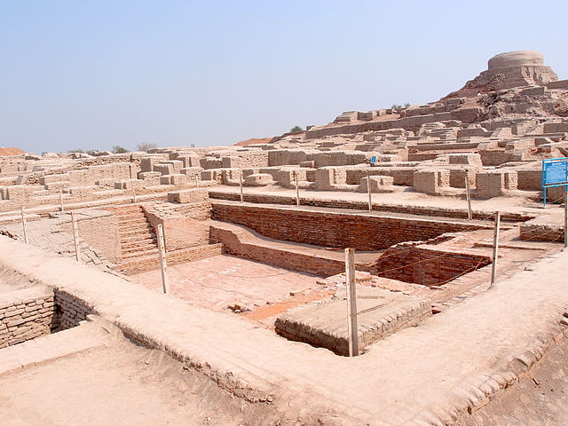

The last few lessons have stressed the concept that the development of social complexity in prehistoric (and historic) populations was a complex process, often following different trajectories with different characteristics and rates of change. We also looked at how the development of agriculture in multiple regions of the world and how that milestone was associated with changes in settlement patterns, population growth, and, often, in social complexity.  Prehistoric cultures in Mesopotamia and Egypt took contrasting routes, why shouldn't others? 
 
In this lesson, we will continue exploring variation in the development of social complexity (e.g., social stratification, urbanization, writing, etc.) on the Asian continent. Specifically, we will look at the civilizations arising in the Indus River Valley (parts of modern-day Pakistan and India), Yellow River Valley in northern China, and Cambodia.
 
In the Indus Valley, we will concentrate on the Harappan culture, known for its well-planned cities, like the urban center at Mohenjo-Daro (below). We will look at origins and development of early Chinese civilizations, like the Xia and Shang Dynasties. Finally, in Southeast Asia, a great civilization, the Khmer Empire, arose in modern-day Cambodia. 
 

 
 

Be sure to watch the lecture slideshow and spend some time browsing the online resources (provided) and supplementary readings in the textbook.
 
You are doing great!  After this lesson, we will turn our attention to the Western Hemisphere and consider prehistoric developments in Mesoamerica and the Andean region of South America.

### Objectives

By the end of this lesson, you should understand the following:
 
- Describe and evaluate the archaeological evidence for urbanism and social inequality in the Harappan civilization.

- Understand the archaeological evidence for the emergence of state-level societies in eastern Asia (China and Cambodia).

-----
#### Continue
Continue through the module to access more.