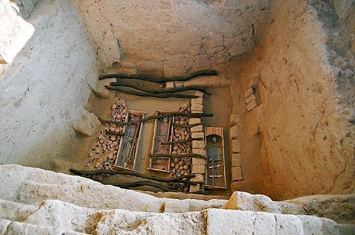

### What to expect
This week's lesson includes a quiz and discussion forum. In addition to going over the lecture slideshow, you may be interested (and, it would be helpful) in checking out the provided additional resources on archaeology in Mesoamerica and the Andean region of South America discussed in this lesson. 

### Prehistoric Greatness in the Americas
By now, you should have some appreciation of the development of social complexity, particularly regarding state-organized societies. You've seen some examples of how this process played out in parts of the Old World; now, we're going to consider these processes in the New World, specifically Mesoamerica and the Andean region of South America. 

### A note on linked web resources
Remember, take the time to check out the web-links I provide. Often, they (along with the textbook) clarify highlights that from the lecture slideshow.

- Mesoamerica
    + [Bulleted list outlining Mesoamerican prehistory](http://www.utexas.edu/courses/stross/ant322m_files/prehistory.htm)
    + [Religion/cosmology of prehistoric Mesoamerica from PBS Nature](http://www.pbs.org/wnet/nature/spirits/html/body_intro.html)
    + [Mayan city of Palenque, a UNESCO World Heritage Site](http://whc.unesco.org/en/list/411)
    + [Aztec glyphic writing](http://www.ancientscripts.com/aztec.html)
 
- Andean South America
    + [Peru's ancient past](http://www.sptimes.com/peru/piecing_together.html)
    + [Lord of Sipan from the Moche culture](http://agutie.homestead.com/files/Sipan.htm)
    + [Machu Picchu, a lasting treasure of the Inca](http://whc.unesco.org/en/list/274)
    + [Peruvian mummies (they're not just for the Egyptians)](http://www.pbs.org/wgbh/nova/peru/)
    + [Khipu:  recording data with knots](http://khipukamayuq.fas.harvard.edu/index.html)
    
- European Contact
    +  [Interactive PBS documentary on Conquistadors in the Americas](http://www.pbs.org/opb/conquistadors/home.htm)
    

__If a hyperlink doesn't work with a simple click, right-click and select "Open in a new tab/window."__

### Lecture Slideshow
To provide more background information and highlight the main concepts, I have provided a slideshow on the following page.

### Readings
Content for this lesson comes from Chapters 13 and 14 in the textbook. As usual, it would be useful to at least skim over the material before proceeding through the module.

### What's next?
- Lesson 10 Discussion:  Rise and Fall in the Americas

In this discussion activity, students will consider factors contributing to the rise and fall of civilizations in the Americas, specifically those discussed in Lesson 10. More information on this forum is included on the "Discussion Info/Instructions" page.

- Lesson 10 Quiz:  This quiz reviews the content covered in this lesson.

---------

#### Continue
Continue through the module to access the slideshow and assignment links.
