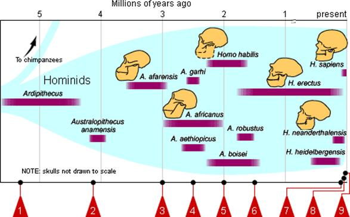
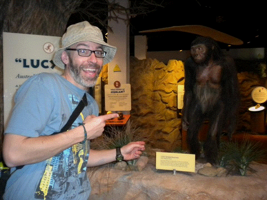

### What to expect

Activities for this lesson include a discussion and quiz. In addition to going over the lecture slideshow, you may be interested (and, it would be helpful) in checking out some other resources that offer general and specific information regarding the complex story of human evolution. For example, the Smithsonian Museum of Natural History has an excellent website devoted to the question, "<a href="http://humanorigins.si.edu/" target="_blank">What does it mean to be human?</a>." This site provides interactive timelines, 3-D images of fossils, and other activities that explore what we currently know about human evolution. Also, Arizona State University's <a href="https://iho.asu.edu/" target="_blank">Institute of Human Origins</a> has some current information on what's happening in this field.

 

 

One the thing to keep in mind, you may notice that date ranges for fossil hominin species vary, depending on the source. This is to be expected! Remember what you have already learned about dating methods. Archaeologists studying early human prehistory and paleoanthropology will not be using much radiocarbon dating, since that method relies on organic material and is only reliable up to about 50 kya (kya = thousand years ago). The last 50 kya are only a small portion of our prehistory. We are dealing with time scales in the millions of years. So, the discrepancy of 0.1, 0.2, or even 0.3 million years (i.e., hundreds of thousands of years) is often within the margin of error for these dating methods.

 

 

It's not necessary that you memorize the exact date ranges for every fossil species discussed, but that you can conceptualize a general timeline of these hominins (like that above). For example, by the end of the lesson, you should understand that *Australopithecus afarensis* (pictured with me below) was a type of hominin that existed around 3.5 million years ago, and that many (but not all) of the __australopithecines__---members of the genus Australopithecus---predate our own genus, *Homo*, which does not appear in the fossil record until about 2.5 million years ago.

### A note on linked web resources
Remember, take the time to check out the web-links I provide. Often, they (along with the textbook) clarify highlights that from the lecture slideshow.

__If a hyperlink doesn't work with a simple click, right-click and select "Open in a new tab/window."__

### Lecture Slideshow
To provide more background information and highlight the main concepts, I have provided a slideshow on the following page.

### Readings
The content for this week's lesson is spread over Chapters 3--6 (pp. 52--169). Again, it may be useful to look over the terms at the end of each chapter before you read the material.

### What's next?

- Lesson 5 Discussion:  Archaeology, Paleontology, and Human Evolution
    + This discussion forum gives you and your classmates an opportunity to explore the interpretations and implications of the research into the "deep" prehistory of the human species. In particular, this discussion asks students to reflect on what they learn about the archaeological and paleoanthropological evidence for human origins and apply this knowledge to the question of the validity of the concept of "race."

- Lesson 5 Quiz:  This quiz reviews the content covered in this lesson.

---------

#### Continue
Continue through the module to access the slideshow and assignment links.
