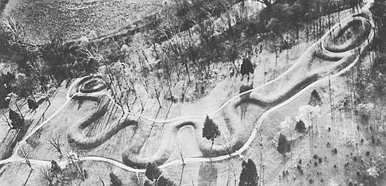

### What to expect
Activities for this lesson include a discussion and quiz. In addition to going over the lecture slideshow, you may be interested (and, it would be helpful) in checking out some other resources that offer more details on early plant and animal domestication and developments in social complexity around the world.

-------

Some extra notes on plant/animal domestication in the New World:

- <a href="http://www.tulane.edu/~kidder/Anth%20201/Lecture%20outlines/Anth%20201%20lect%2030%20outline.html" target="blank">Bulleted highlights</a> on New World domesticates

- Did the America's earliest domesticated plant---the bottle gourd---have <a href="http://www.pnas.org/content/102/51/18315.full" target="_blank">an Asian origin</a>?

-------

### Give the "New" World Some Love
In the past, although not so much these days, North American archaeology has largely played second-fiddle to archaeology in other parts of the world, especially the <a href="http://en.wikipedia.org/wiki/Old_World" target="_blank">Old World</a>. There are a number of reasons for this trajectory of archaeological research. For one, until relatively recently, the Western Hemisphere was largely unknown to Europeans. And, recall that early archaeologists (well, _antiquarians_) were, generally, European. Another factor is that, at least in eastern North America, prehistoric and <a href="http://en.wikipedia.org/wiki/Protohistory" target="_blank">protohistoric</a> societies did not have access to the same types of raw building materials used in other regions, like stone in Mesoamerica or adobe in the American Southwest. Thus, prior to U.S. westward expansion, explorers and early archaeologists had little permanent architecture to observe. 

 

 

That all changed, as people began recording the existence of large, earthen mounds along the Mississippi River and river valleys of its larger tributaries (e.g., Ohio River, Illinois River, etc.). These mounds ranged in size and shape; some were conical, platform, or even effigy mounds, like the Great Serpent Mound (pictured above) and a bird effigy mound, located within Effigy Mounds National Monument, Iowa.

 

<figure>
  
  <figcaption>Electrical resistance image---bird effigy, Mound 81, Effigy Mounds National Monument, Iowa. Image credit:  Ken Kvamme, <a href="https://wayback.archive-it.org/6471/20130302042831/http://www.cast.uark.edu/nadag/projects_database/Kvamme1/Kvamme1-r3-img.htm" target="_blank">Center for Advanced Spatial Technologies</a>.</figcaption>
</figure>

  
 

Mound centers like Cahokia (Illinois), Moundville (Alabama), and others provided support for the idea that prehistoric North American was home to socially complex societies. In the last hundred years, more and more research has provided evidence that social complexity developed in a myriad of ways, dependent upon local conditions (i.e., environment, ecology, cultural history...).  Another great example is the Kuk Swamp area, where archaeologists uncovered some of the earliest evidence of agriculture in the Western Highlands of Papua New Guinea. This complexity is exactly what this lesson is about.

 

 

#### A note on linked web resources
Remember, take the time to check out the web-links I provide. Often, they clarify highlights that you see in the lecture slideshow.

__If a hyperlink doesn't work with a simple click, right-click and select "Open in a new tab/window."__

### Lecture Slideshow
To provide more background information and highlight the main concepts, I have provided a slideshow on the following page.

### Readings
Readings include all content from the module pages, lecture slides, and linked external web content.

### What's next?
- Lesson 7 Discussion:  Just eat it!

This discussion forum gives you and your classmates an opportunity to explore the archaeological evidence for variation in plant/animal domestication and developments in social complexity in different parts of the world.

- Lesson 7 Quiz:  This quiz reviews the content covered in this lesson.

---------

#### Continue
Continue through the module to access the slideshow and assignment links.
