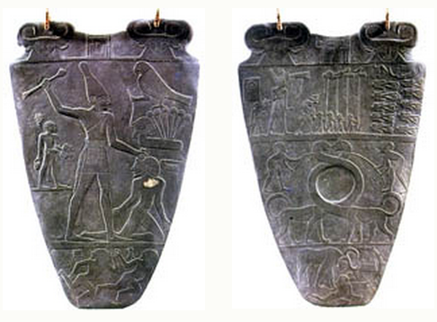

### What to expect
Activities for this lesson include a discussion and quiz. In addition to going over the lecture slideshow, you may be interested (and, it would be helpful) in checking out some other resources on the archaeology of Mesopotamia and Egypt (see below).

### Walk like an Egyptian
When I ask students what they think of when they think of archaeology (remember to our "Introductions" discussion), they often mention something related to ~~ancient~~ premodern Egypt (e.g., King Tut, pyramids, etc.). Egyptian archaeology is a classic case study in imperial archaeology. In the 19th and early-20th centuries, countless numbers of Egypt's cultural treasures were taken, without consent, and continue to be displayed in museums around the world. This brings us back to the question, "who owns the past?". I hope this is something you continue to think of as we make our way through the last few lessons.

In this lesson we'll be looking at the earliest-known development of state-level organization, which are found in Mesopotamia and Egypt. On a side note (and less serious note), the Predynastic site of [Hierakonpolis](http://www.hierakonpolis-online.org/)---which is where the data for my doctoral dissertation come from and is also mentioned in the text---is also mentioned as one of the [earliest-known instances of a zombie outbreak](http://archive.archaeology.org/online/features/hierakonpolis/zombies.html).  :-)

 

 

?](../assets/rock_scorpion.jpg)

 

### A note on linked web resources
Remember, take the time to check out the web-links I provide. Often, they (along with the textbook) clarify highlights that from the lecture slideshow.

- __University of Chicago's Oriental Institute__
    + [OI's archaeology projects (general)](http://oi.uchicago.edu/research/projects/oriental-institute-archaeology-projects)
    + [OI's "Lost Treasures from Iraq"](http://oi-archive.uchicago.edu/OI/IRAQ/iraq.html)
    + [OI's Giza Plateau Mapping Project](http://oi.uchicago.edu/research/projects/giza-plateau-mapping-project-gpmp-0)
 
 
- __Extra resources for Egypt__
    + [Digital Egypt for Universities](http://www.ucl.ac.uk/museums-static/digitalegypt//)
    + [The Armarna Project](http://www.amarnaproject.com/)
 
- __Extra resources for Old World archaeology__
    + [Stephen Savage's Old World Archaeology Page](http://gaialab.asu.edu/Jordan/)
    + [Archaeology Maps and Timeline-click on Near East and Egypt](http://www.utexas.edu/courses/denbow/worldmap/archworld.htm) (note some of the site names and timelines)

__If a hyperlink doesn't work with a simple click, right-click and select "Open in a new tab/window."__

### Lecture Slideshow
To provide more background information and highlight the main concepts, I have provided a slideshow on the following page.

### Readings
Content for this lesson comes primarily from Chapter 11 in the textbook. As usual, it would be useful to at least skim over the material before proceeding through the module.

### What's next?
- Lesson 8 Discussion:  I'm in a City-State of Mind

This discussion forum gives you and your classmates an opportunity to explore contrasts in the development of state-level organization in Mesopotamia and Egypt.

- Lesson 8 Quiz:  This quiz reviews the content covered in this lesson.

---------

#### Continue
Continue through the module to access the slideshow and assignment links.
