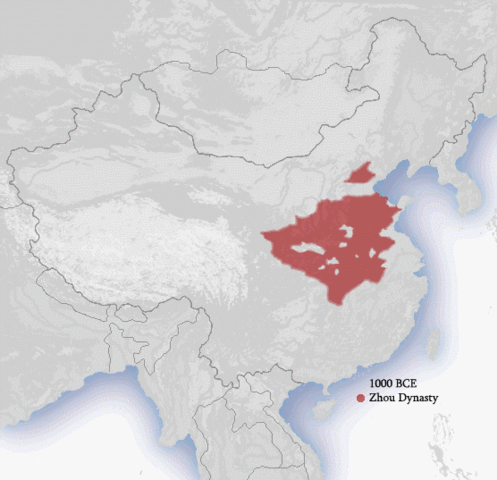
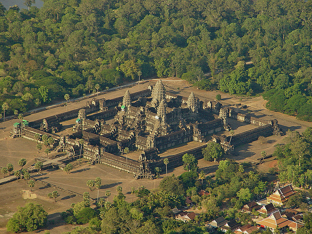

### What to expect
This week's lesson falls in a holiday week, so the graded activities are fewer than normal. Here, activities include a mandatory quiz and optional discussion forum---worth a maximum of five percentage points added to one's final exam score. In addition to going over the lecture slideshow, you may be interested (and, it would be helpful) in checking out the provided additional resources on archaeology in the regions of Asia discussed in this lesson. 

### Exploring Asian Prehistory/Early History
As you'll see, archaeologists are learning more and more about the development and spread of the Harappan culture in the Indus Valley and surrounding area. Theirs is an ancient writing system that has not, yet, been deciphered.

On the other hand, many traditions of modern-day Chinese culture (not their communist political system, of course) have roots in the early, state-level civilizations there. Also, the Khmer culture, which developed into an empire, is just recently becoming better known to archaeologists. In this lesson, we'll be considering cultural developments in these regions.

### A note on linked web resources
Remember, take the time to check out the web-links I provide. Often, they (along with the textbook) clarify highlights that from the lecture slideshow.

- Indus Valley cultures
    + Tour some of the great prehistoric/historic [civilizations of the Indus Valley](http://www.harappa.com/indus/indus1.html). Marvel at the standardization of Harappan urban centers, like [Harappa](http://www.harappa.com/walk/) and [Mohenjo-Daro](http://www.mohenjodaro.net/index.html). 
 
- Chinese cultures
    + Not surprisingly, early increases in social complexity and the emergence of state-level society arose along rivers in [ancient China](http://www.ancientchina.co.uk/menu.html). Certainly, the [river was important](http://www.ancientchina.co.uk/geography/story/sto_set.html) for early peoples there. Though modern-day China is not the same as in the past, Chinese culture shows remarkable continuity over the [last two thousand years](http://www.chaos.umd.edu/history/time_line.html).
    

- Cambodian cultures
    + One of the largest archaeological sites in the world is Angkor in present-day Cambodia. These sites represent the remains of great capitals of the Khmer Empire. [Interactively explore](http://ngm.nationalgeographic.com/2009/07/angkor/angkor-animation) the Khmer Empire with National Geographic (and try to keep in mind that this society was flourishing while Europe was wallowing in the "Dark Ages."
    

__If a hyperlink doesn't work with a simple click, right-click and select "Open in a new tab/window."__

### Lecture Slideshow
To provide more background information and highlight the main concepts, I have provided a slideshow on the following page.

### Readings
Content for this lesson comes primarily from Chapter 12 in the textbook. As usual, it would be useful to at least skim over the material before proceeding through the module.

### What's next?
- Lesson 9 Discussion:  Exploring Asian (Pre-)History

This is an __optional__ discussion forum that gives you and your classmates an opportunity to share what you felt was most interesting or surprising about the content covered in Lesson 9. More information on this forum is included on the "Discussion Info/Instructions" page.

- Lesson 9 Quiz:  This quiz reviews the content covered in this lesson and is a __mandatory__, graded activity.

---------

#### Continue
Continue through the module to access the slideshow and assignment links.
